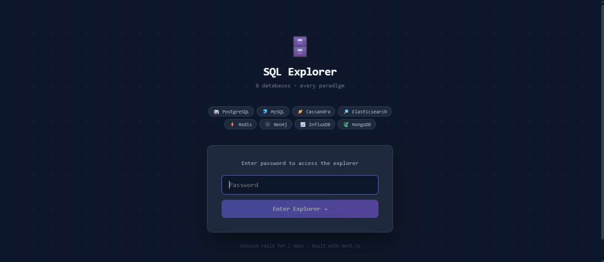
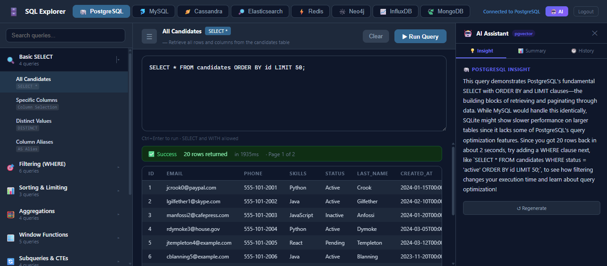
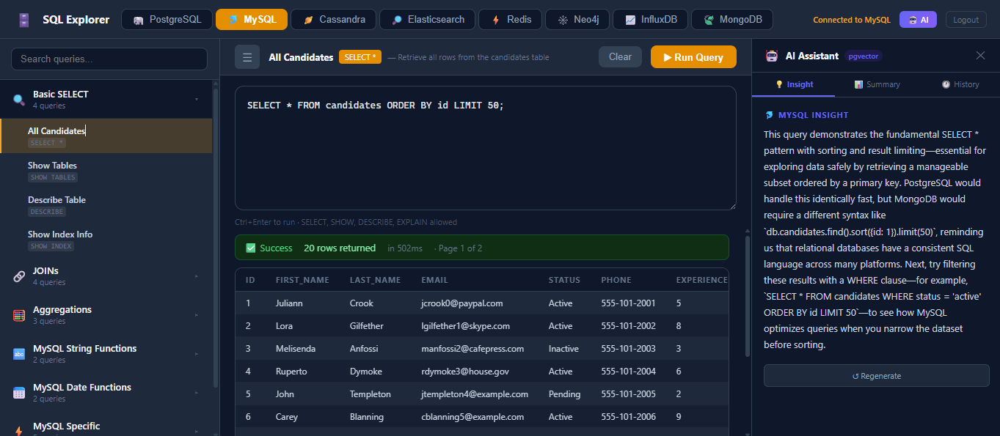
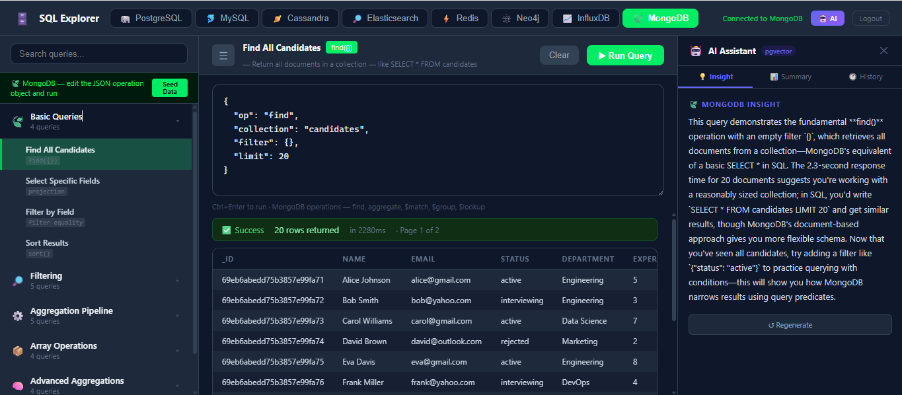
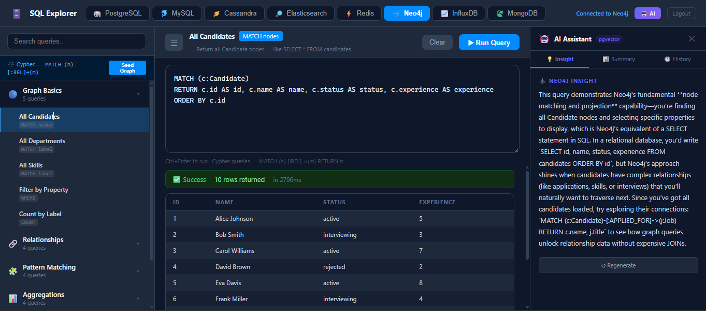
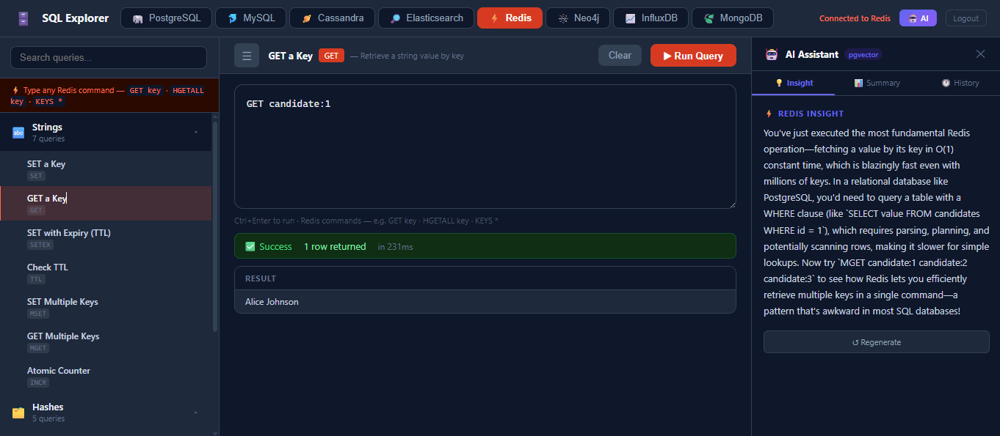
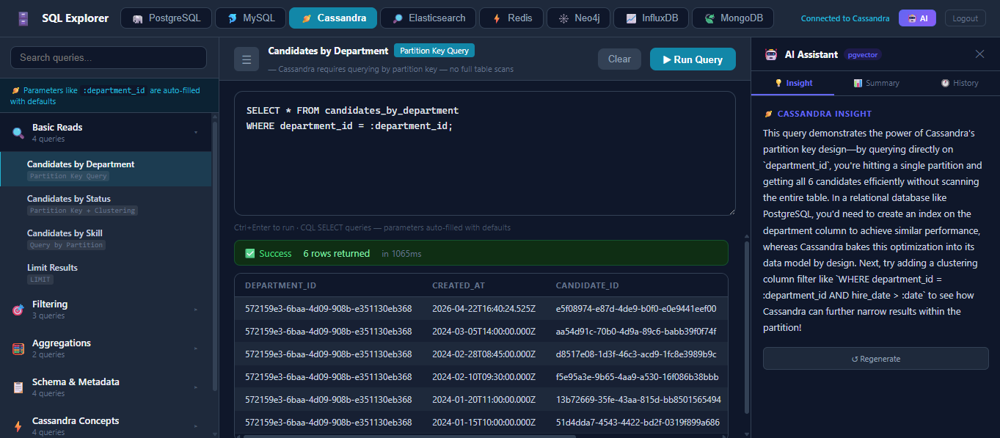
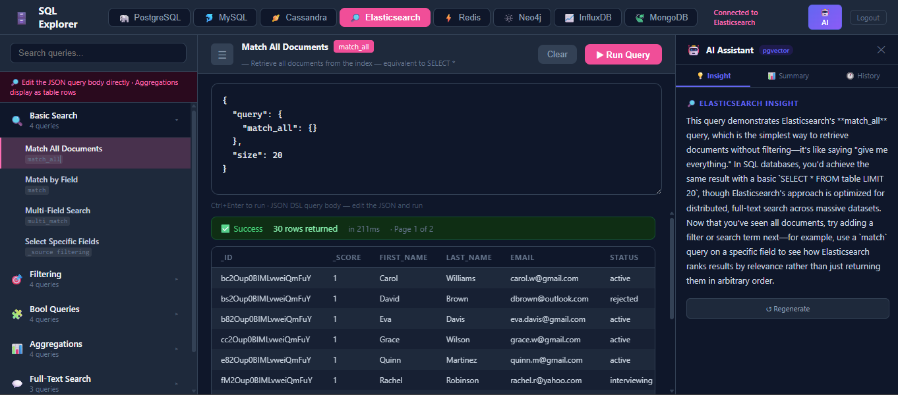
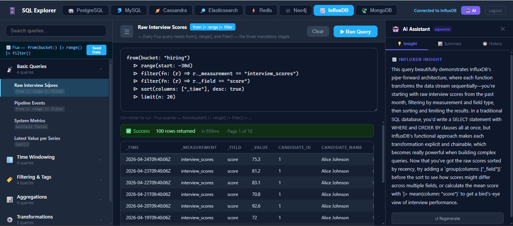

<div align="center">

# 🗄️ SQL Explorer

### An AI-powered, multi-paradigm database learning platform — run live queries across 8 databases from a single interface

[](https://nextjs.org)
[](https://www.typescriptlang.org)
[](https://anthropic.com)
[](https://supabase.com)
[](https://vercel.com) 

**[🔗 Live Demo → sql-nextjs.vercel.app](https://sql-nextjs.vercel.app)**

</div>

---

## 🔑 Access & Demo

**[sql-nextjs.vercel.app](https://sql-nextjs.vercel.app)** — Password-protected.

> 📞 **Need the password? Call or WhatsApp: [+91 97277 92839](tel:+919727792839)**
>
> _Some databases (Cassandra, Redis, Neo4j) spin down on inactivity and AI queries (Claude Haiku) incur API costs — so access is shared on request rather than left fully open. Happy to walk you through a live demo too._

---

## Overview

SQL Explorer is a full-stack web application for running **real queries against 8 live production databases** — each connected to a cloud instance with real data. An **AI assistant (Claude + pgvector)** explains every query in context, compares paradigms across databases, and tracks your learning history semantically.

Built to demonstrate deep understanding of database paradigms and system design across relational, document, graph, time-series, wide-column, search, key-value, and vector models — not just syntax, but *when* and *why* each database shines.

---

## 📸 Screenshots

### Login


### PostgreSQL — Relational


### MySQL — Relational


### MongoDB — Document


### Neo4j — Graph


### Redis — Key-Value


### Cassandra — Wide-Column


### Elasticsearch — Search Engine


### InfluxDB — Time-Series


> 📁 **To add screenshots:** Save the images to a `screenshots/` folder in the repo root with the filenames above.

---

## 🗃️ 8 Databases, 8 Paradigms

| # | Database | Paradigm | Cloud | Key Concepts |
|---|----------|----------|-------|--------------|
| 1 | 🐘 **PostgreSQL** | Relational | Supabase | JOINs, CTEs, Window Functions, Indexes |
| 2 | 🐬 **MySQL** | Relational | Railway | Full-Text Search, Stored Procedures, Date/Time |
| 3 | 🍃 **MongoDB** | Document | Atlas | Aggregation Pipeline, `$lookup`, `$unwind`, `$facet` |
| 4 | 🕸️ **Neo4j** | Graph | AuraDB | Cypher, Relationship Traversal, Shortest Path |
| 5 | ⚡ **Redis** | Key-Value | Railway | Strings, Hashes, Sorted Sets, TTL, Atomic Counters |
| 6 | 🪐 **Cassandra** | Wide-Column | DataStax Astra | Partition Keys, Denormalization, CQL |
| 7 | 🔎 **Elasticsearch** | Search Engine | Elastic Cloud | Inverted Index, Fuzzy Search, Aggregations |
| 8 | 📈 **InfluxDB** | Time-Series | InfluxDB Cloud | Flux, `aggregateWindow`, Downsampling, Anomaly Detection |

---

## 🤖 AI Assistant — Claude + pgvector

Every query triggers a **three-part AI experience**:

- **💡 Insight** — Claude Haiku explains the query concept, compares it across databases, and suggests the next query to try. Streams in real time.
- **📊 Summary** — Analyzes your complete session history and generates a personalized learning report across all 8 databases.
- **🕐 History** — Every query is stored as a vector embedding in pgvector. Semantically searchable. Timestamped and color-coded by database.

```
You run a query
      │
      ▼
Embedding stored in pgvector (Supabase)
      │
      ▼
Claude Haiku streams an insight:
"This $group pipeline stage in MongoDB maps directly to
 GROUP BY in SQL — try $facet next for multi-dimensional
 aggregations in a single query pass."
```

---

## ✨ Features

- **160+ curated example queries** organized by concept and database
- **Real-time streaming** AI responses via Anthropic API
- **Semantic search** over query history using pgvector cosine similarity
- **Password-protected** with Next.js middleware and HttpOnly 7-day cookie session
- **One-click seed** — populate every database with a consistent hiring/candidates dataset
- **Ctrl+Enter** to run — keyboard-first workflow
- **Pagination + execution time** on all result sets
- **Same data domain across all 8 databases** — enables direct cross-paradigm comparison

---

## 🏗️ Architecture

```
┌─────────────────────────────────────────────────────────────────┐
│                        Next.js 14 App Router                    │
├──────────────┬──────────────────────────┬───────────────────────┤
│   Sidebar    │      Query Editor         │      AI Panel         │
│  160+ queries│  Textarea + Results table │  Insight / Summary    │
│   8 DB tabs  │  Pagination + exec time  │  History (pgvector)   │
└──────┬───────┴────────────┬────────────┴──────────┬────────────┘
       │                    │                        │
       ▼                    ▼                        ▼
  Next.js API          Next.js API            Anthropic API
   Routes               Routes                Claude Haiku
  (8 DB clients)      (pgvector store)          (streaming)
```

### API Routes

```
/api/query            → PostgreSQL    (Supabase RPC + native driver)
/api/mysql            → MySQL         (mysql2)
/api/cassandra/**     → Cassandra     (cassandra-driver + Astra secure bundle)
/api/elasticsearch/   → Elasticsearch (REST + API key)
/api/redis/           → Redis         (ioredis)
/api/neo4j/           → Neo4j         (neo4j-driver)
/api/influxdb/        → InfluxDB      (@influxdata/influxdb-client)
/api/mongodb/         → MongoDB       (mongodb native driver)
/api/ai/insight       → Streaming insight   (Anthropic Claude Haiku)
/api/ai/summary       → Session summary     (Anthropic Claude Haiku)
/api/ai/history       → Vector history      (pgvector cosine similarity)
/api/auth             → Login / logout      (HttpOnly cookie)
```

---

## 🧠 Cross-Paradigm Query Comparison

The same question — "find all active candidates" — across 6 paradigms:

```sql
-- PostgreSQL / MySQL (Relational)
SELECT * FROM candidates WHERE status = 'active' ORDER BY id;

-- MongoDB (Document)
db.candidates.find({ status: 'active' })

-- Elasticsearch (Search)
{ "query": { "term": { "status.keyword": "active" } } }

-- Redis (Key-Value)
SMEMBERS status:active

-- Neo4j (Graph)
MATCH (c:Candidate {status: 'active'}) RETURN c

-- Cassandra (Wide-Column)
SELECT * FROM candidates_by_status WHERE status = 'Active'
```

Same question, 6 fundamentally different paradigms — that's the point.

---

## 🛠️ Tech Stack

| Layer | Technology |
|-------|-----------|
| Framework | Next.js 14 (App Router + Server Components) |
| Language | TypeScript — strict mode |
| Auth | Next.js Middleware + HttpOnly cookies (no library) |
| AI | Anthropic Claude Haiku — streaming responses |
| Vector Store | pgvector on Supabase PostgreSQL |
| Database Drivers | Raw native drivers — no ORMs |
| Deployment | Vercel (Edge Middleware + Serverless Functions) |
| Styling | Inline styles — zero CSS framework dependencies |

---

## ⚙️ Engineering Decisions

**No ORMs — raw drivers only.**
Every database uses its native driver: `cassandra-driver`, `neo4j-driver`, `mongodb`, `ioredis`, `@influxdata/influxdb-client`. This exposes exactly what's happening at the protocol level rather than hiding it behind abstractions.

**Cassandra on Vercel — Serverless Bundle Problem.**
Cassandra's driver requires a secure zip bundle for DataStax Astra connections. Vercel serverless functions can't include local zip files in the bundle. Solution: upload the bundle to Supabase Storage, download it at runtime into `/tmp` on cold start.

**Neo4j result serialization.**
Neo4j's driver returns `ReadonlyArray` for result keys. After JSON serialization through the API route, this becomes a plain object that breaks React's `.map()`. Fixed by explicitly calling `Array.from()` at the API layer before returning results.

**Auth without a library.**
Next.js middleware intercepts every request and checks for an HttpOnly cookie. `/api/auth` sets it on correct password, deletes on logout. No NextAuth, no JWT library — a plain secure cookie with a 7-day expiry. Simple, auditable, zero dependencies.

**Streaming AI responses.**
Claude Haiku responses stream token-by-token using `ReadableStream`. The API route writes chunks directly to the response; the client reads them incrementally using `response.body.getReader()` — no WebSockets, no polling.

---

## 🚀 Running Locally

```bash
git clone https://github.com/devReact001/sql-nextjs.git
cd sql-nextjs
npm install
```

Create `.env.local`:

```env
# PostgreSQL (Supabase)
NEXT_PUBLIC_SUPABASE_URL=
NEXT_PUBLIC_SUPABASE_ANON_KEY=
SUPABASE_SERVICE_KEY=

# MySQL (Railway)
MYSQL_HOST=
MYSQL_PORT=
MYSQL_USER=
MYSQL_PASSWORD=
MYSQL_DATABASE=

# Cassandra (DataStax Astra)
CASSANDRA_BUNDLE_URL=
CASSANDRA_USERNAME=
CASSANDRA_PASSWORD=
CASSANDRA_KEYSPACE=

# Elasticsearch (Elastic Cloud)
ELASTICSEARCH_URL=
ELASTICSEARCH_API_KEY=

# Redis (Railway)
REDIS_URL=

# Neo4j (AuraDB)
NEO4J_URI=
NEO4J_USERNAME=
NEO4J_PASSWORD=
NEO4J_DATABASE=

# InfluxDB Cloud
INFLUXDB_URL=
INFLUXDB_TOKEN=
INFLUXDB_ORG=
INFLUXDB_BUCKET=
NEXT_PUBLIC_INFLUXDB_BUCKET=

# MongoDB (Atlas)
MONGODB_URI=
MONGODB_DB=

# Auth
APP_PASSWORD=

# AI
ANTHROPIC_API_KEY=
```

```bash
npm run dev
# http://localhost:3000
```

Use the **Seed Data** button in each database tab to populate with the hiring dataset. Run `pgvector-setup.sql` once in Supabase SQL Editor to enable the vector store.

---

## 📊 By The Numbers

| Metric | Value |
|--------|-------|
| Databases | 8 |
| Database paradigms | 8 / 8 |
| Example queries | 160+ |
| API routes | 25+ |
| Cloud services integrated | 9 |
| TypeScript lines | 5,000+ |

---

## 📄 License

MIT — free to fork, learn from, and build on top of this.

---

<div align="center">

Built with ❤️ using Next.js · TypeScript · Claude · pgvector · and 8 database drivers

**[🔗 Live Demo](https://sql-nextjs.vercel.app)** · **[💻 GitHub](https://github.com/devReact001/sql-nextjs)**

</div>